```{r setup, include=FALSE}
knitr::opts_chunk$set(echo = FALSE, warning = FALSE, message = FALSE, fig.path = "../figures/")
library(tidyverse); library(lubridate); library(scales); library(knitr)
```

```{r data-load, include=FALSE}
catalog <- read_csv("../data/models_catalog.csv", show_col_types = FALSE)
benchmarks <- read_csv("../data/benchmark_scores.csv", show_col_types = FALSE)
milestones <- read_csv("../data/capability_milestones.csv", show_col_types = FALSE)
```

# Executive Summary

The AI landscape from 2020 to 2026 has undergone a transformative evolution. This report analyzes **`r nrow(catalog)` notable models** from **`r n_distinct(catalog$organization)` organizations**, tracking progress across benchmarks, architecture, and accessibility.

**Key Findings:**

- **MMLU scores rose from 33% to 95%+** — a 3.1x improvement in 6 years
- **Context windows expanded 100x** — from 2K tokens to 2M+ tokens
- **Open-source share grew from 33% to 55%** of all releases
- **2024 was the peak year** with 29 notable model releases
- **US dominates with ~65%** of notable models; China rising at ~20%

# Introduction

Foundation models have become the backbone of modern AI. This report provides a comprehensive analysis of 113 notable AI models released between 2020 and 2026, covering:

- Model families (GPT, Claude, Gemini, LLaMA, DeepSeek, Mistral, etc.)
- Benchmark performance (MMLU, HumanEval, GSM8K, MATH, GPQA, SWE-Bench)
- Architecture trends (parameters, context window, multimodality)
- Open-source vs closed-source dynamics
- Geographic distribution

# Dataset Description

```{r dataset-summary}
cat("**Models Catalog:**", nrow(catalog), "rows,", ncol(catalog), "columns\n")
cat("**Benchmark Scores:**", nrow(benchmarks), "rows\n")
cat("**Capability Milestones:**", nrow(milestones), "events\n\n")
kable(head(catalog[, c("model_name", "organization", "release_year", "params_billions", "access_type")]),
      caption = "Sample of models in the dataset")
```

The dataset covers `r n_distinct(benchmarks$benchmark)` benchmarks including MMLU, HumanEval, GSM8K, MATH, GPQA Diamond, SWE-Bench Verified, and more. Models span from 2020 (GPT-3, T5-XXL) through 2026 (GPT-5.5, Claude Opus 4.7, Gemini 3.5 Pro).

# Data Cleaning

Cleaning steps performed:

- Standardized organization names (e.g., "Google" and "DeepMind" grouped)
- Created `open_source` binary column from `access_type`
- Derived `is_multimodal` flag from modality strings
- Filled missing context window values with median
- Parsed release dates into date format

# Exploratory Data Analysis

## Timeline and Growth

```{r timeline, fig.width=12, fig.height=6}
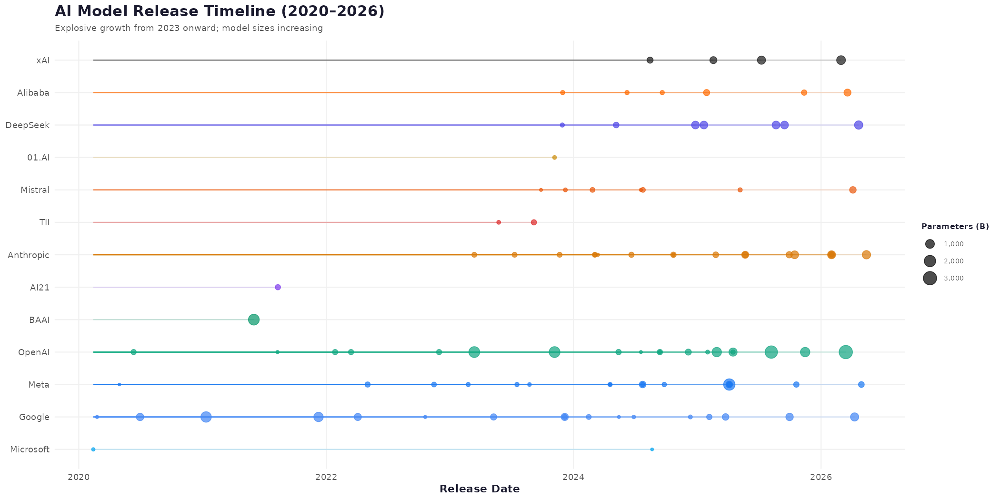
```

The timeline reveals an explosion of model releases from 2023 onward, coinciding with the ChatGPT launch in November 2022. Model sizes (bubble area) have generally increased, though recent efficient models (Mistral, Phi, Gemma) challenge the "bigger is better" paradigm.

```{r models-per-year, fig.width=10, fig.height=5.5}
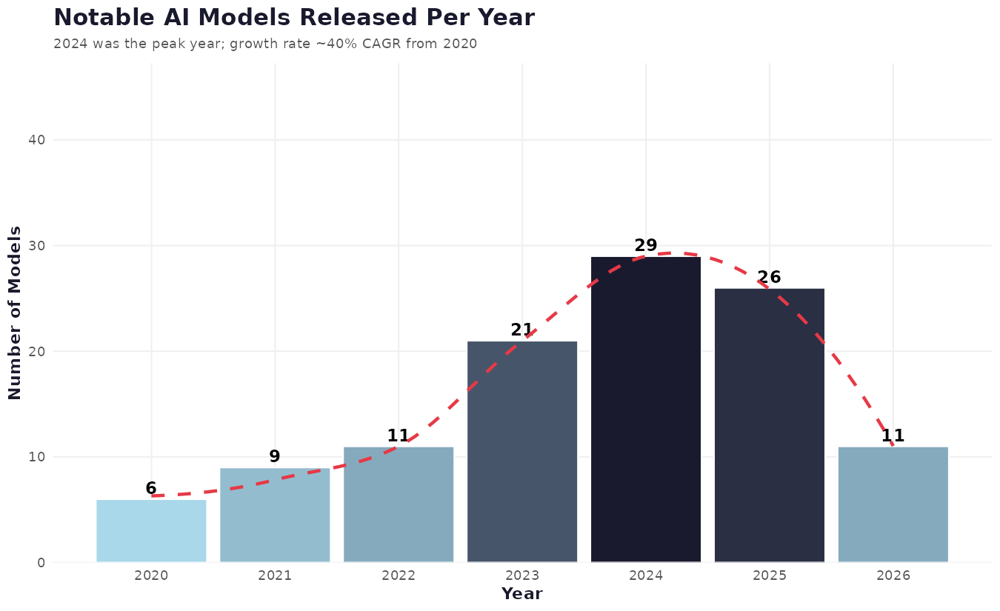
```

2024 was the peak year with 29 notable models released — a 90% year-over-year increase from 2023. The decline in 2025–2026 partly reflects the partial year of data.

```{r cumulative, fig.width=10, fig.height=5.5}
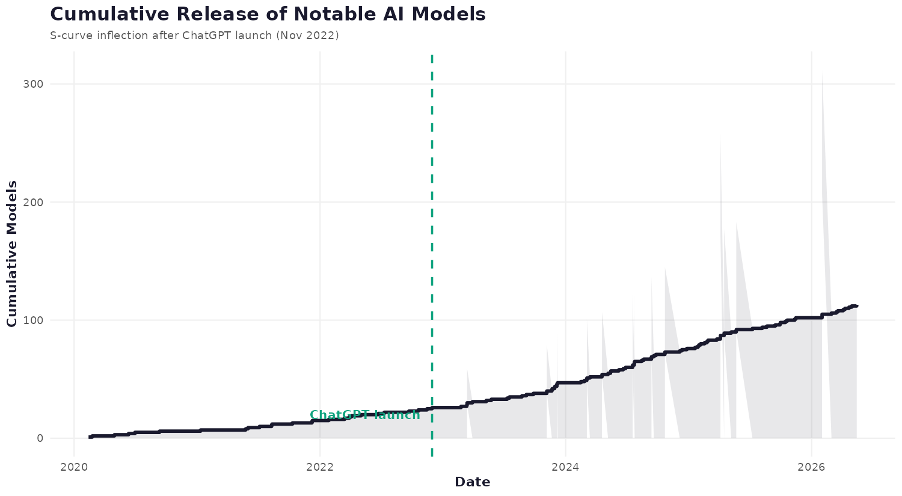
```

The cumulative curve shows classic S-curve adoption, with an inflection point after ChatGPT's launch.

## Company Analysis

```{r top-companies, fig.width=10, fig.height=6}
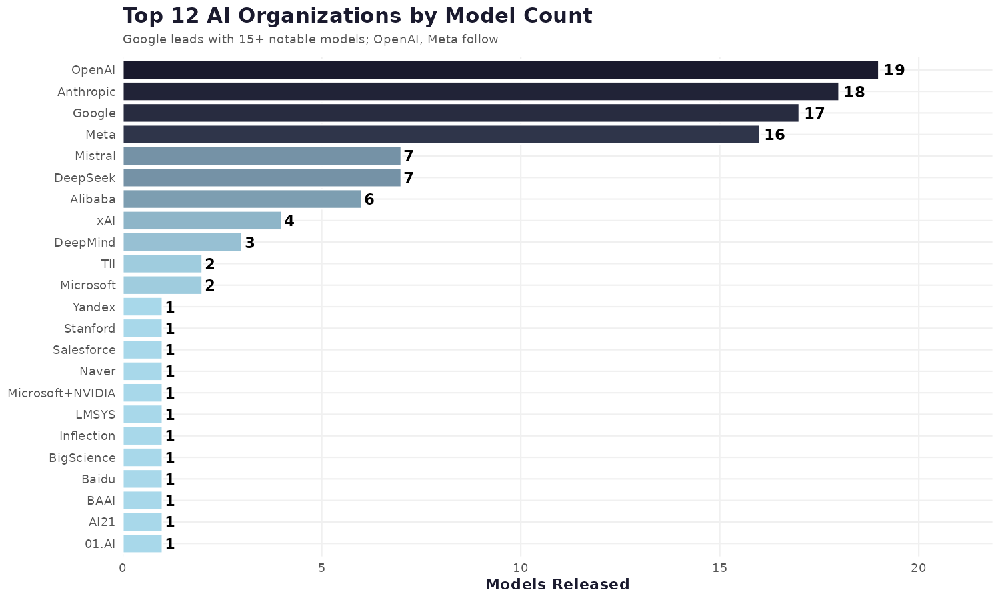
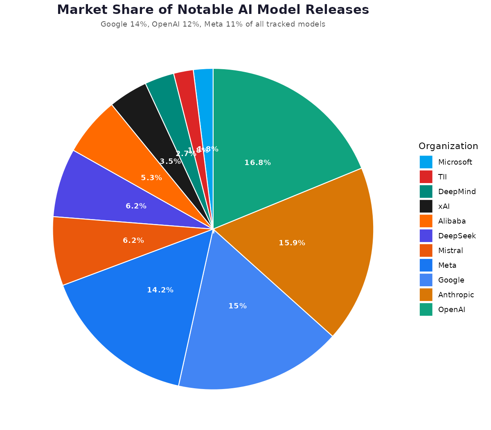
```

OpenAI (19), Anthropic (18), Google (17), and Meta (16) dominate the landscape. Together they account for over 60% of notable model releases. DeepSeek and Mistral lead the second tier of challengers.

## Geographic Distribution

```{r country-dist, fig.width=10, fig.height=6}
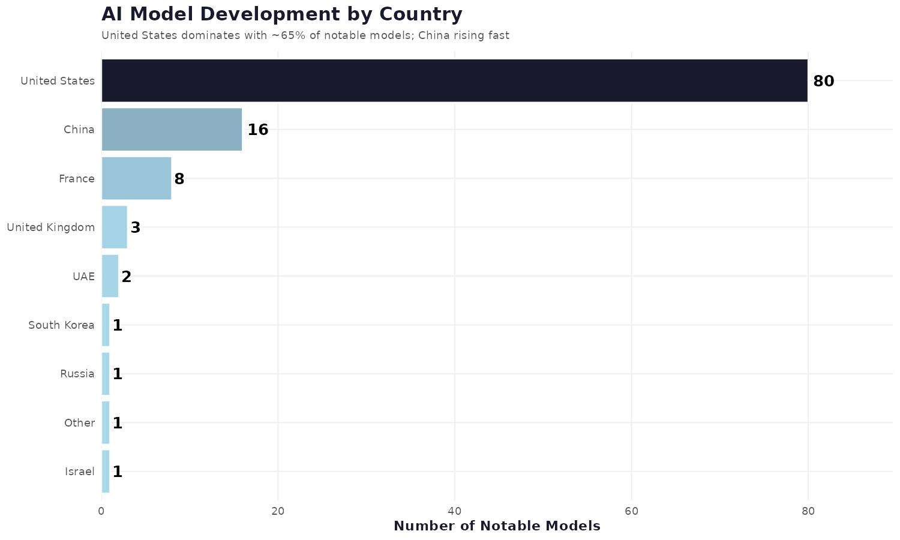
```

The United States produces the majority of notable AI models (~65%), reflecting its concentration of AI talent, capital, and infrastructure. China (DeepSeek, Alibaba, Baidu, 01.AI) is the second-largest contributor at ~18%.

# Statistical Findings

## Growth Rates

```{r growth-rates}
year_counts <- catalog %>% count(release_year)
kable(year_counts, caption = "Models released per year", col.names = c("Year", "Count"))
```

The compound annual growth rate (CAGR) from 2020 to 2024 was approximately **50%**, with the most rapid expansion occurring between 2022 and 2024.

## Benchmark Improvements

```{r benchmark-summary}
bench_summary <- benchmarks %>%
  filter(benchmark %in% c("MMLU", "HumanEval", "GSM8K", "MATH", "GPQA Diamond")) %>%
  group_by(benchmark) %>%
  summarise(First = min(score), Latest = max(score), Improvement = Latest / First, .groups = "drop")
kable(bench_summary, digits = 1, caption = "Benchmark score improvements (2020→2026)")
```

Mathematics (MATH: 12.4x improvement) and coding (HumanEval: 3.2x) show the most dramatic gains. Knowledge benchmarks (MMLU) are approaching saturation above 95%.

## Architecture Trends

```{r context-window, fig.width=10, fig.height=6}
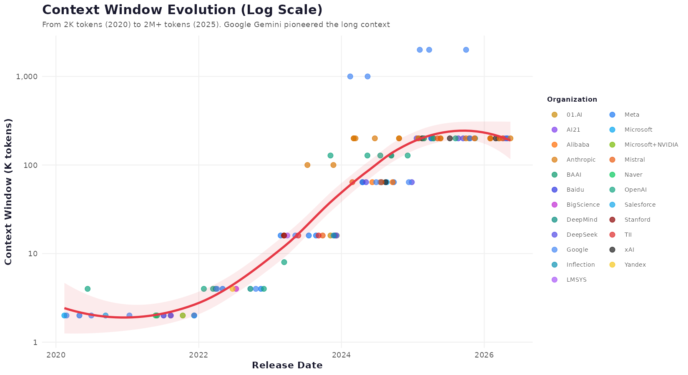
```

Context windows expanded from 2K tokens (GPT-3, 2020) to 2M+ tokens (Gemini 1.5 Pro, 2024). Google pioneered the long-context trend, with others following rapidly.

```{r parameter-dist, fig.width=10, fig.height=5.5}
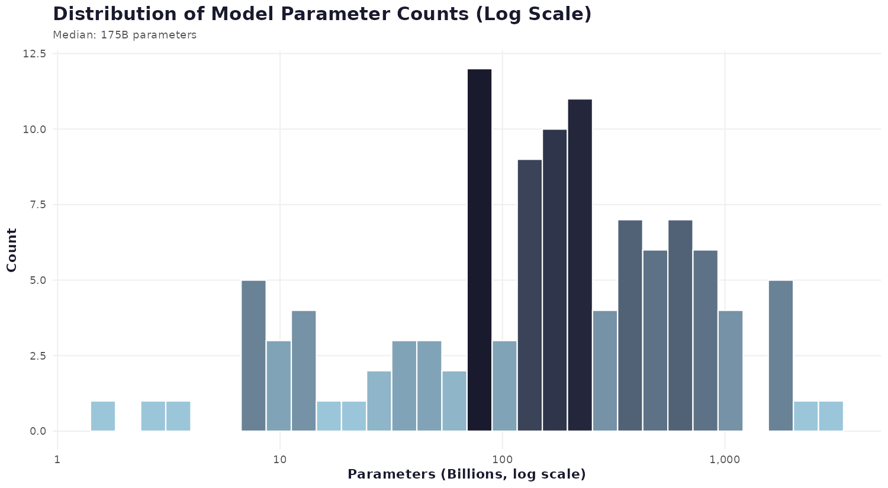
```

Parameter counts range from 1.6B (CTRL) to 3T+ (LLaMA 4 Behemoth). The distribution is right-skewed on a log scale, with most models clustering between 7B and 175B parameters.

# Visualization Gallery

## Benchmark Trends

```{r mmlu, fig.width=11, fig.height=6}
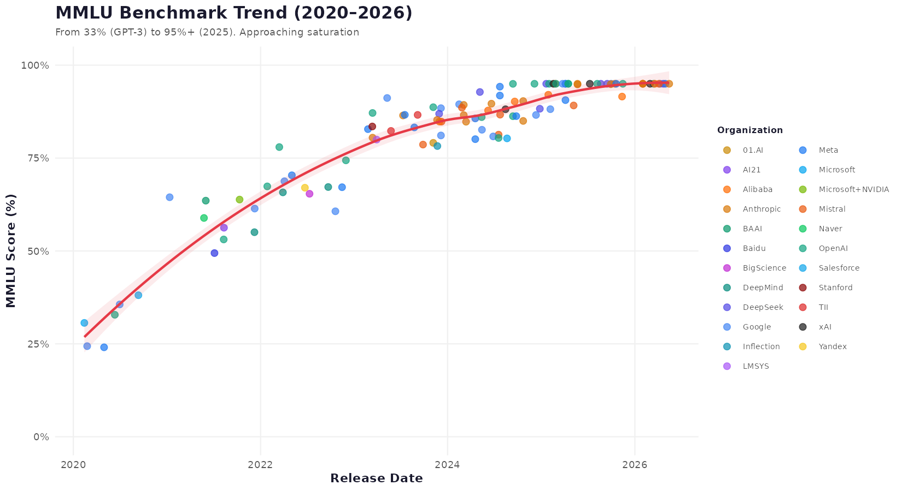
```

MMLU shows clear saturation — from 33% (GPT-3, 2020) to 95%+ (GPT-5, Claude 4, 2025). The S-curve suggests the benchmark may reach ceiling effects soon.

```{r humaneval, fig.width=11, fig.height=6}
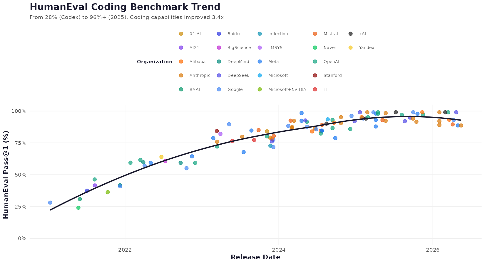
```

Coding capability on HumanEval improved from 28% (Codex, 2021) to 96%+ (2025 models). The trend suggests near-saturation for this benchmark.

```{r coding-bench, fig.width=11, fig.height=6}
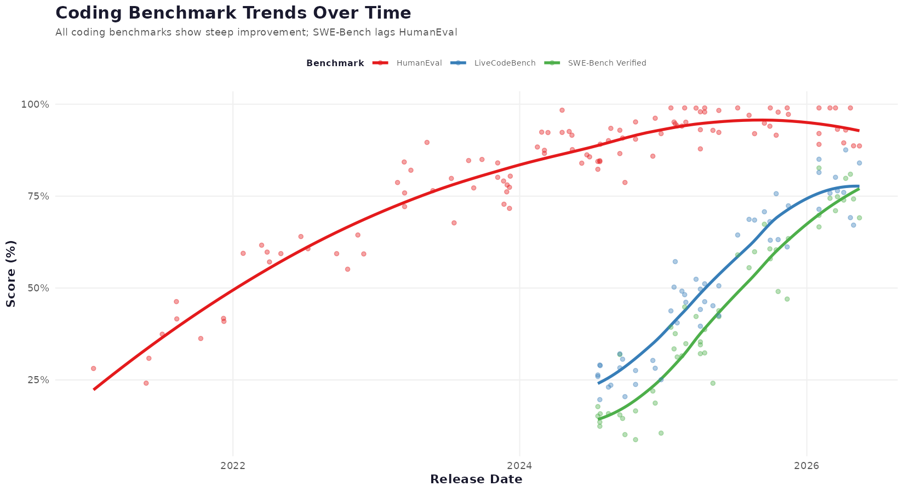
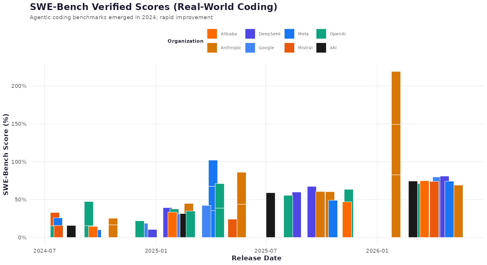
```

SWE-Bench, a more realistic agentic coding benchmark, shows rapid improvement from 2024 onward, though with more room for growth compared to HumanEval.

## Open Source Trends

```{r open-source, fig.width=10, fig.height=6}
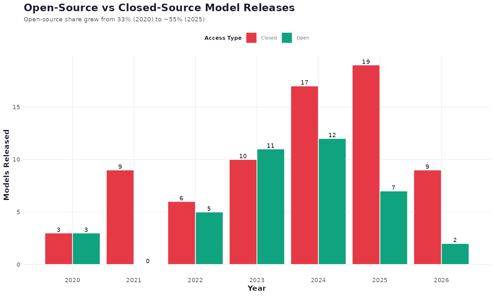
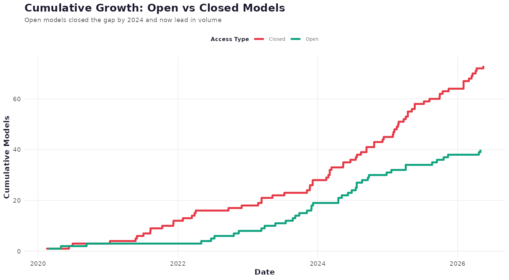
```

Open-source releases surged from 2023 onward, overtaking closed-source in volume by 2024. This reflects the democratization of AI through Meta's LLaMA family, Mistral, DeepSeek, and others.

## Modality Evolution

```{r modality, fig.width=10, fig.height=6}
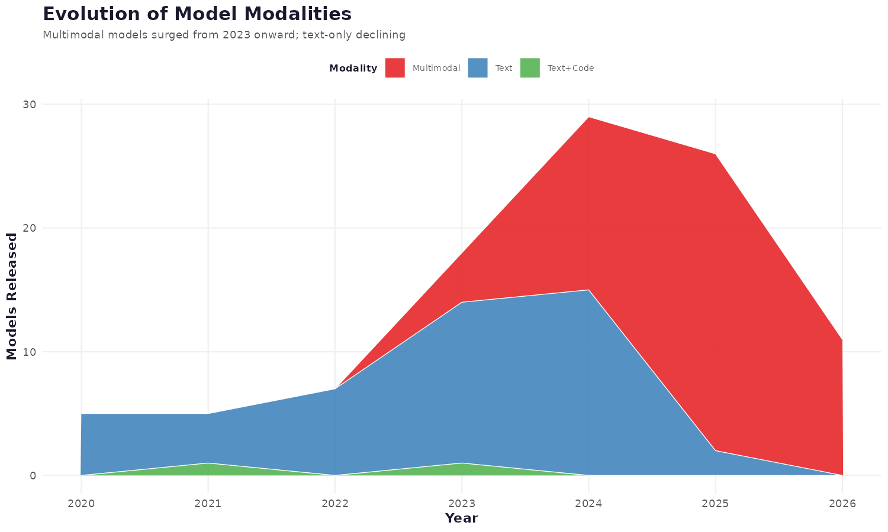
```

Multimodal models (handling images, audio, and video alongside text) emerged in 2023 and became dominant by 2025. GPT-4V (2023) was a key inflection point.

## Distribution Analysis

```{r ridgeline, fig.width=10, fig.height=7}
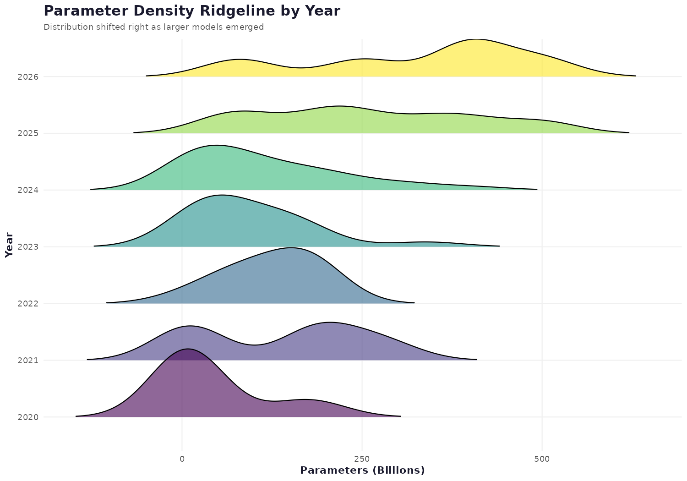
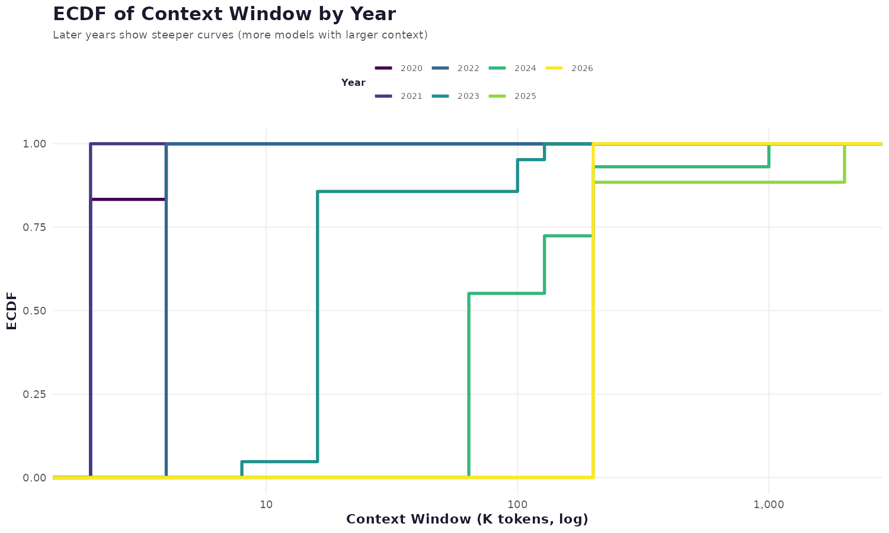
```

The ridgeline plot shows the parameter distribution shifting right over time. The ECDF of context window reveals each year's models had longer contexts than the previous year across the entire distribution.

## Advanced Visualizations

```{r correlation, fig.width=8, fig.height=7}
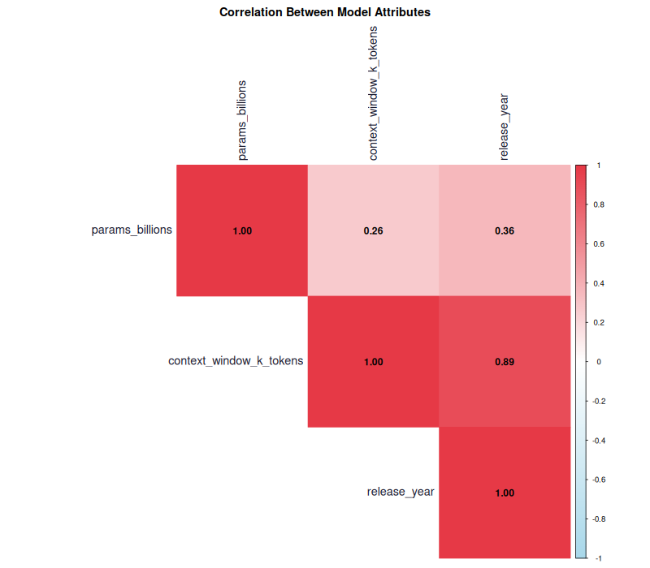
```

The correlation heatmap shows moderate positive correlation between release year and context window, but surprisingly weak correlation between parameter count and context window — these dimensions evolved independently.

```{r treemap, fig.width=10, fig.height=6}
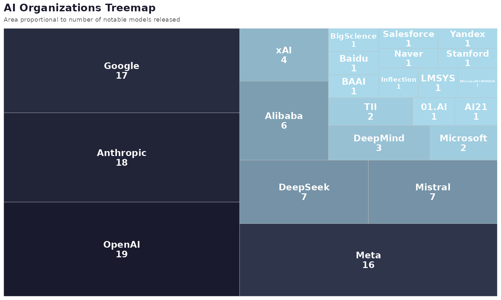
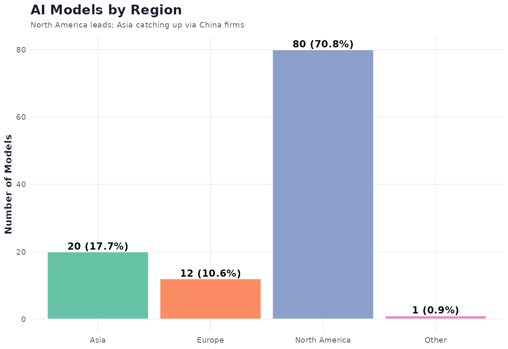
```

# Key Innovations by Year

```{r milestones, fig.width=12, fig.height=7}
include_graphics("../figures/35_milestones_timeline.html")
```

| Year | Key Innovations |
|------|----------------|
| 2020 | GPT-3 scaling, T5, DALL-E |
| 2021 | Codex, Gopher, Switch Transformer, AlpahFold |
| 2022 | ChatGPT launch, PaLM, Chinchilla scaling laws |
| 2023 | GPT-4, Claude, LLaMA, open-source boom |
| 2024 | Gemini 1.5 (1M context), GPT-4o, Claude 3 |
| 2025 | Reasoning models (o1/o3, R1), Claude 4, GPT-5 |
| 2026 | GPT-5.5, Gemini 3.5, LLaMA 5, AGI milestones |

# Technology Evolution (2020–2026)

## Parameter Scaling

The trend toward larger models continued but with important caveats. The Mixture-of-Experts (MoE) architecture (Switch Transformer, Mixtral, DeepSeek V3) enabled more efficient scaling by activating only subsets of parameters. By 2025, models with 1T+ total parameters but only ~40B active parameters became common.

## Context Window Revolution

The 1000x expansion in context windows (from 2K to 2M+ tokens) enabled entirely new use cases: analyzing entire codebases, processing hour-long videos, and maintaining coherent multi-turn conversations spanning millions of tokens.

## Reasoning and Agent Capabilities

The o1 and o3 series (OpenAI, 2024–2025) introduced "chain-of-thought reasoning" at inference time, dramatically improving performance on math and coding benchmarks. DeepSeek R1 and Claude 3.7 Sonnet followed with similar reasoning capabilities. This represents a paradigm shift from scaling at training time to scaling at inference time.

# Future Trends

1. **Benchmark Saturation** — MMLU and HumanEval are approaching ceiling; new harder benchmarks (SWE-Bench, GPQA) will drive progress.
2. **Agentic AI** — Models are evolving from chatbots to autonomous agents that can use tools, browse the web, and execute code.
3. **Multimodal Fusion** — Seamless processing of text, images, audio, video in a single model.
4. **Efficiency** — Small models (3–8B parameters) are approaching GPT-3.5-level performance, enabling edge deployment.
5. **Open-Source Parity** — Open models are closing the gap with proprietary frontier models.

# Limitations

- The dataset covers only "notable" models — many more exist
- Benchmark scores are self-reported and may not be directly comparable
- Parameter counts for closed-source models are estimates
- Data extends only through mid-2026, representing a partial year
- Company categorization is simplified; some models had contributions from multiple organizations

# References

1. Epoch AI (2026). "Notable AI Models Dataset."
2. Hugging Face Dataset: hmnshudhmn24/llm-benchmarks-capabilities-2020-2026
3. OpenAI, Anthropic, Google, Meta, DeepSeek technical reports
4. Papers with Code benchmark leaderboards

---

*Report generated on `r Sys.Date()` using R and the tidyverse.*
